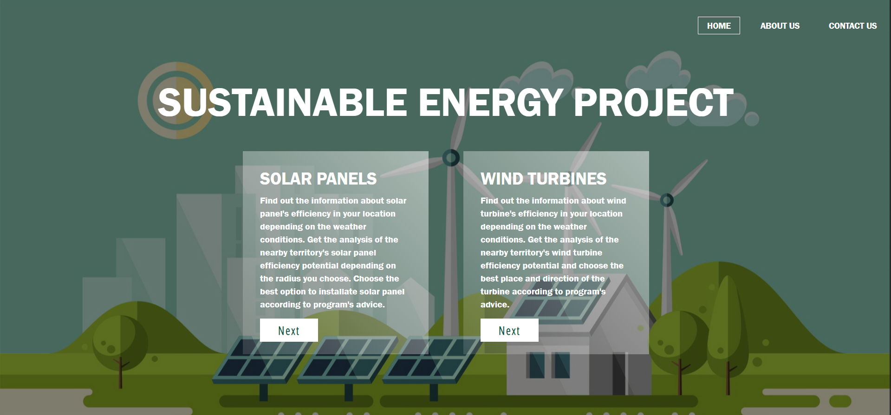
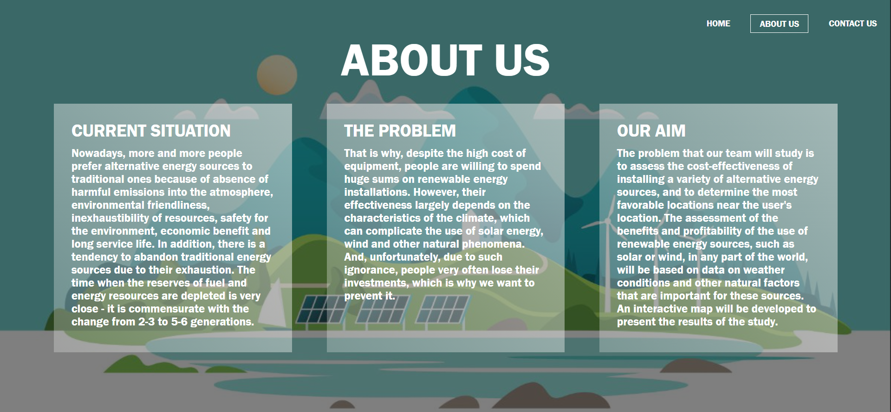
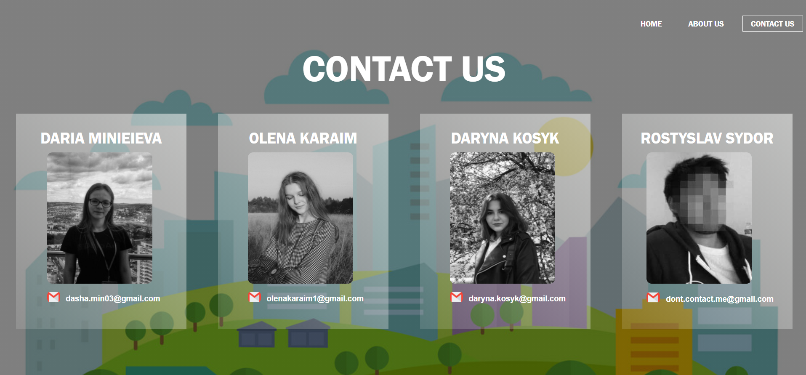
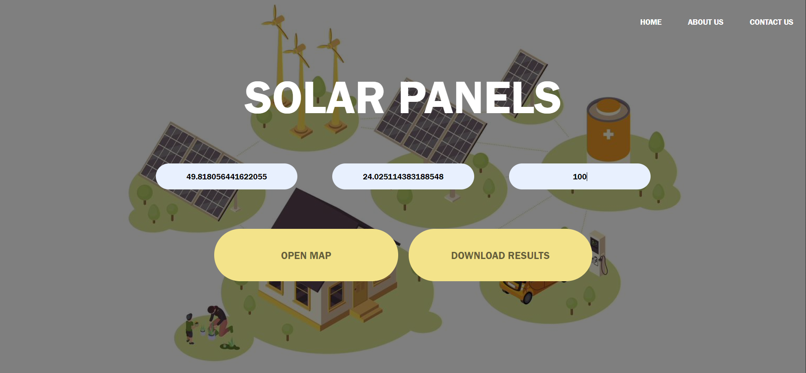
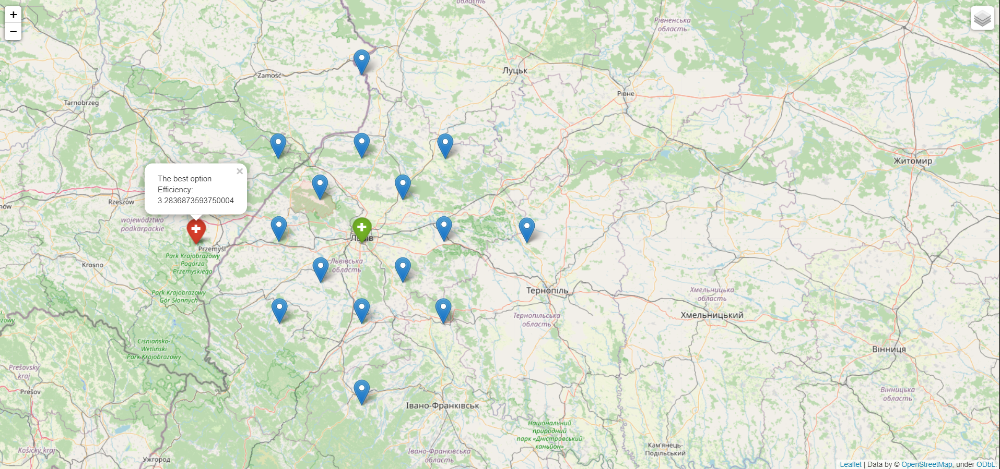
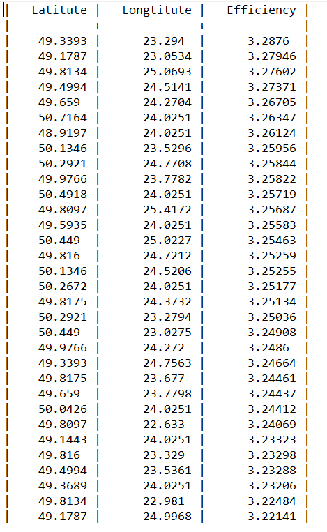
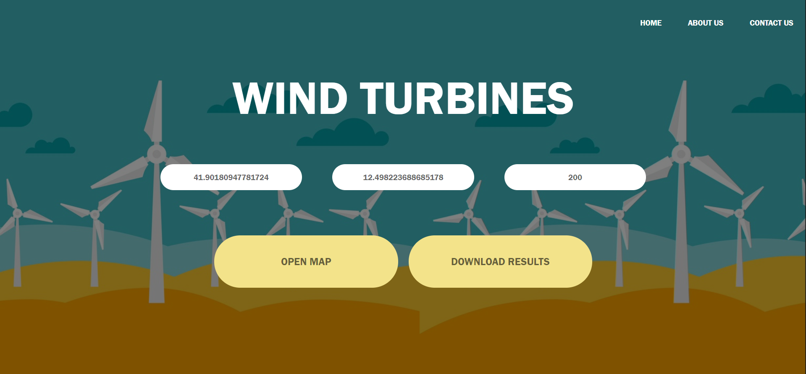
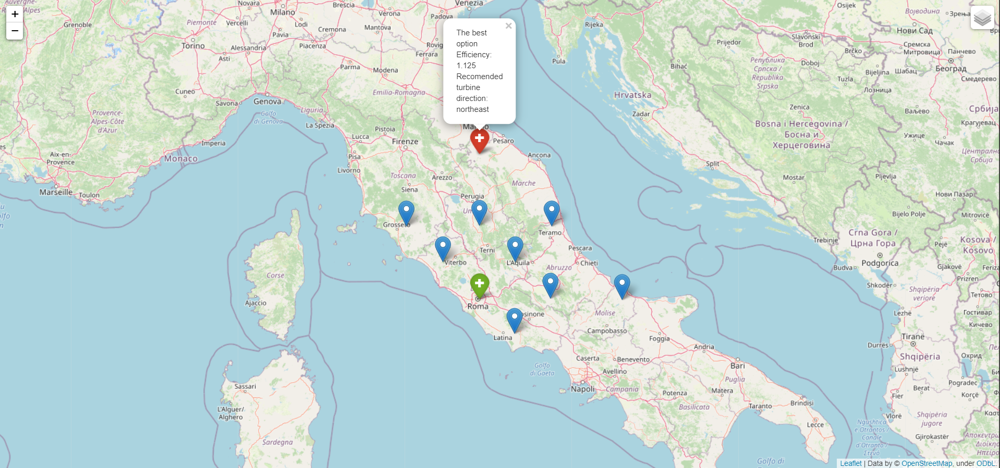
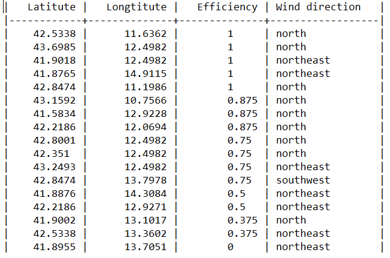

# sustainable_energy_project

## CURRENT SITUATION
Nowadays, more and more people prefer alternative energy sources to traditional ones because of absence of harmful emissions into the atmosphere, environmental friendliness, inexhaustibility of resources, safety for the environment, economic benefit and long service life. In addition, there is a tendency to abandon traditional energy sources due to their exhaustion. The time when the reserves of fuel and energy resources are depleted is very close - it is commensurate with the change from 2-3 to 5-6 generations.

## THE PROBLEM
That is why, despite the high cost of equipment, people are willing to spend huge sums on renewable energy installations. However, their effectiveness largely depends on the characteristics of the climate, which can complicate the use of solar energy, wind and other natural phenomena. And, unfortunately, due to such ignorance, people very often lose their investments, which is why we want to prevent it.
PROGRAM’S AIM AND CHARACTERISTICS
The problem that our team will study is to assess the cost-effectiveness of installing a variety of alternative energy sources, and to determine the most favorable locations near the user's location. The assessment of the benefits and profitability of the use of renewable energy sources, such as solar or wind, in any part of the world, will be based on data on weather conditions and other natural factors that are important for these sources. An interactive map will be developed to present the results of the study.
The purpose of the program is to simplify a search for a place to install an alternative energy source - a solar panel or wind turbine. Program’s main functional is: the user chooses what kind of alternative sources he is interested in, sets the location and radius within which the analysis of the territory will be carried out. After that, the program calculates the efficiency of the selected energy source at the selected location and at points within the radius. The user receives information about the most favorable place to install the energy source, as well as the best direction to install if a wind turbine is selected. The results can be seen on the map and can also be downloaded in .txt format. 

## PROGRAM’S AIM AND CHARACTERISTICS
The problem that our team will study is to assess the cost-effectiveness of installing a variety of alternative energy sources, and to determine the most favorable locations near the user's location. The assessment of the benefits and profitability of the use of renewable energy sources, such as solar or wind, in any part of the world, will be based on data on weather conditions and other natural factors that are important for these sources. An interactive map will be developed to present the results of the study.
The purpose of the program is to simplify a search for a place to install an alternative energy source - a solar panel or wind turbine. Program’s main functional is: the user chooses what kind of alternative sources he is interested in, sets the location and radius within which the analysis of the territory will be carried out. After that, the program calculates the efficiency of the selected energy source at the selected location and at points within the radius. The user receives information about the most favorable place to install the energy source, as well as the best direction to install if a wind turbine is selected. The results can be seen on the map and can also be downloaded in .txt format. 

## PROGRAM’S STRUCTURE AND SHORT DESCRIPTION OF MODULES, FUNCTIONS, CLASSES AND METHODS
This project is located in the folder sustainable_energy and has the following structure:

1. Module [project.py](http://project.py/) - the main module that launches flask project.
2. Folder templates - contains the following html-pages of the web application.
    1. about_us.html - page with information about the project.
    2. contact_us.html - developer contacts page.
    3. mainpage.html - the main page of the project.
    4. solar_panels.html - a page that allows users to get data about solar panels.
    5. wind_turbines.html - page that allows users to get data about wind turbines.
    6. User-created maps are also stored in this folder.
3. Static folder, which contains all the necessary styles and pictures for this project.
4. The map_creator folder, which contains all the basic logic of the web application in the following modules
    1. adt_realization.py - implementation of abstract data types. You can read more about them at the following link: [https://github.com/DariaMinieieva/sustainable_energy_project/wiki/3.-Домашнє-завдання-№3#_ADT](https://github.com/DariaMinieieva/sustainable_energy_project/wiki/3.-%D0%94%D0%BE%D0%BC%D0%B0%D1%88%D0%BD%D1%94-%D0%B7%D0%B0%D0%B2%D0%B4%D0%B0%D0%BD%D0%BD%D1%8F-%E2%84%963#_ADT)
    2. [linkedlist.py](http://linkedlist.py/) - implementation of the Linked List data structure
    3. main_code.py - the main module, which contains the following functions:
        1. get_lat_long (central_lat, central_long, distance) - accepts the latitude and longitude of the place entered by the user and the radius in which he or she wants to place the selected alternative energy source.
        2. map_generator (locations, start_location, max_value) - takes the input of the location, the initial location entered by the user, and the best value of efficiency. A map is created that shows the best place to set the selected alternative power source and returns the id value.
        3. get_historical_data (latitude, longitude, energy_source) - accepts the latitude, longitude and type of alternative energy source. Returns a LinkedList with instances of the required ADT (depending on the type of alternative power source entered) with information about the past weather at that point.
        4. get_forecast_data (latitude, longtitute, energy_source) - accepts the latitude, longitude and type of alternative energy source. Returns a LinkedList with instances of the required ADT (depending on the type of alternative energy source entered) with information about the forecast weather at that point.
        5. calculate_efficiency (linked_lst, energy_source) - accepts LinkedList with information about the weather and the type of alternative energy source. Returns the average efficiency at a given point and for wind turbines - the recommended direction in which they should be placed.
        6. all_average_efficiency (locations, energy_source, type_of_data) - accepts the location, the type of alternative energy source and the type of weather data (historical or forecast). Returns a dictionary with coordinates as keys and efficiency values of the selected type of alternative energy source and, for wind turbines, the recommended direction in which they should be returned. The point with the best efficiency also returns
        7. create_txt (locations, energy_source, path) - accepts the location, the type of alternative energy source and the path to the file. Creates a text file that collects the coordinates sorted by efficiency and, for wind turbines, the recommended direction in which they should be rotated.

## SHORT INSTRUCTION
1. To use the program, you need to follow the link to the site.
link: http://daria.pythonanywhere.com/
3. Then you need to choose a source of energy - solar panels or wind turbines. Click on the "NEXT" button.
4. On the page dedicated to the selected energy source, enter the latitude, longitude and radius.
5. Click on the “OPEN MAP” button to go to the interactive map or to “DOWNLOAD RESULTS” to get the results in .txt format.

## Step-by-step website navigation

1. Home page  
  

2. About us page  
  

3. Contact us page  
  

4. Usage example for solar panels  

Main page for solar panels  
  

Interactive map with all locations and the best option chosen  
  

Results in .txt format  
  

5. Usage example for wind turbines  

Main page for wind turbines  
  

Interactive map with all locations and the best option for turbine's location and direction chosen  
  

Results in .txt format  
  

## TESTS’ DESCRIPTION

## INPUT AND OUTPUT DATA
At first, the user chooses the alternative energy source that interests him most. On the page of the selected alternative source, the user is asked to enter data about his or her location: latitude, longitude;  and radius in kilometers for the furthest possible location for the installation of an alternative energy source. As a result, the user gets a map with locations within the maximum specified radius. The map also shows the efficiency of installing an alternative energy source for each point, and shows the location with the highest efficiency. If the user has chosen wind turbines, he also receives information about the best direction for the wind turbine. You can also download the results as a .txt file with the information about the efficiency of the installation in each location; and the most profitable direction of the wind turbine

## CREDITS
1. Daria Minieieva
2. Daryna Kosyk
3. Olena Karaim
4. Rostyslav Sydor

## LICENSE
Sustainable Energy Project is available under MIT license. See LICENSE for more information.
